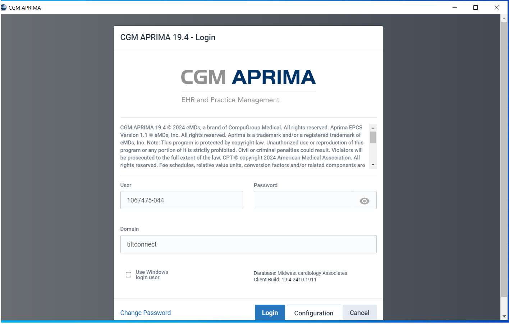
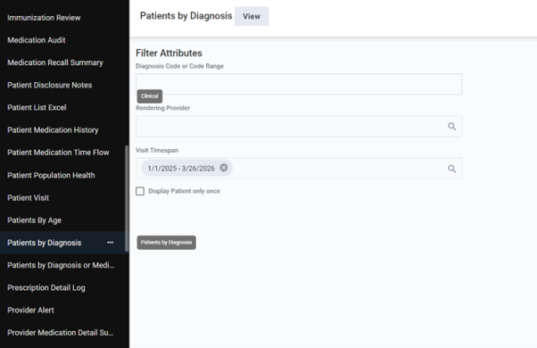
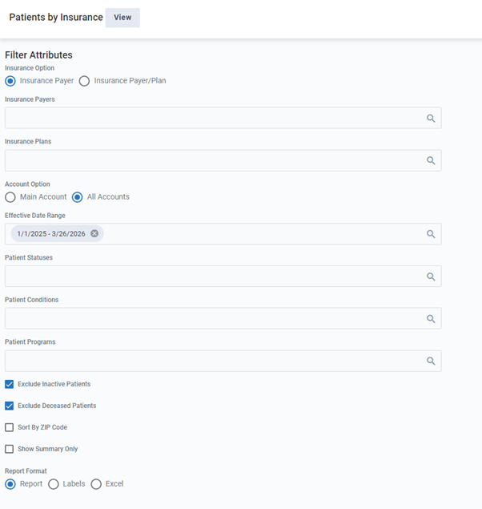

# Medical Care Application - Reports Download Guide

## Login Instructions

1. Establish RDP connection to the server:
   - **RDP Server:** 65.52.246.229
   - **Login User:** 1067475-044
   - **Domain:** tiltconnect

2. Open CGM APRIMA software.

3. Enter your credentials to log in to the application.

   

## Downloading Reports

Follow the detailed steps below for each report type. All reports should be exported in Excel format.

### 1. Patient Demographics and Diagnosis Report

1. Navigate to **Reports > Clinical > Patient by Diagnosis**.
2. Set filters:
   - Visit span: Custom date range (1-1-2025 to current date).
3. Click **View** to generate the report.
4. Export to Excel format as "Patients by Diagnosis.xlsx".

   
   
   

   **Note:** Patients may repeat based on primary/secondary diagnoses.

### 2. Patient Insurance Details Report

1. Navigate to **Reports > General Reports > Patients by Insurance**.
2. Set filters:
   - Account option: All Accounts
   - Effective Date Range: 1-1-2025 to current date.
3. Click **View** to generate the report.
4. Export to Excel format as "Patients by Insurance.xlsx".

   
   

   **Note:** No secondary/tertiary insurance details available.

### 3. Patients With Visits By Insurance Report

1. Navigate to **Reports > Clinical Quality > Patients With Visits By Insurance**.
2. Set filters:
   - Visit Dates: Custom range (1-1-2025 to current date).
3. Click **View** to generate the report.
4. Export to Excel format as "Patients With Visits By Insurance.xlsx".

   
   

   **Note:** Ignore patients without insurance.

### 4. Services By Provider Summary Report

1. Navigate to **Reports > Clinical > Services By Provider Summary**.
2. Set filters:
   - Timespan: Custom Dates (1-1-2025 to current date).
3. Click **View** to generate the report.
4. Export to Excel format as "Services by Provider Summary.xlsx".

   
   

### 5. Patient Center (Patient List) Report

1. Navigate to **Manage Patients > Patient Center**.
2. Set settings:
   - Maximum items returned: -1 (no limit).
3. Go to **File > Export to Excel**.
4. Save as "patient-list.xls" (script will convert to .xlsx).

   
   

### 6. Appointment Reports

Appointment reports can be downloaded by following these steps:

1. Go to **Reports > Scheduled Reports > Appointment Report**.
2. Select the data range from **current date to next one year**.
3. Click **View** to generate the report.
4. As per other reports, click **Export to Excel** to download the report.

   
   